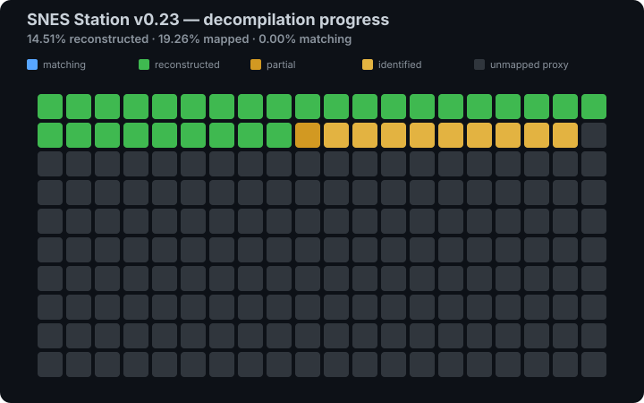

# SNESstation-Decomp

Preservation-oriented decompilation of **SNES Station v0.23 WIP
(24 January 2004)** for PlayStation 2.

The project reconstructs the original PS2 frontend, Snes9x-derived core,
renderer, audio glue, filesystem code and historical runtime as faithfully as
the binary evidence allows. It is not a modern rewrite of the emulator.

> **Status:** active reverse engineering. Structural/source-model coverage is
> closed and the EE source/object tree is build-ready, but a complete
> byte-identical replacement ELF is not yet available.

<!-- DECOMP_PROGRESS_START -->
## Decompilation progress

<p align="center">
  
</p>

> **100% means structural coverage of the audited 1,041-entry target universe.** It is not a claim of byte matching or an exact compiler function count. See [`docs/PROGRESS.generated.md`](docs/PROGRESS.generated.md) for the full accounting.

- **Matching:** 100.00%
- **Formal checkpoint:** **1,041/1,041** strict promoted matches
- **Recovered pending:** **0** (the V53 recovery set is fully formal)
- **Working checkpoint:** **1,041/1,041** with **0** entries remaining
- **Reconstructed:** **100.00%** (1,041/1,041 validated targets)
- **Mapped / identified:** **100.00%** (1,041/1,041 validated targets)
- **Source-form checkpoint:** **1,041 behavioral/source-model + 0 structural-pseudocode-only**
- **Build-ready EE source ownership:** **97/97 TUs** (96 canonical + 1 alternate)
- **Source-address aliases:** **323/337 proved**, **14 blocked**
- **Zero-byte link contracts:** **1,336/1,569 resolved**, **233 blocked** (1,273 address anchors + 63 semantic aliases)
- **Private embedded assets:** **10/10 providers**, **62,736 verified private bytes**, **223 remaining externals**
- **Source-link provider namespace:** **223/223 resolved**, **0 aggregate externals** (175 anchors + 9 aliases + 39 storage + 0 shims)
- **Original Stage-3C named data:** **54/54 closed** (**50 exact target ranges + 4 completed source refactors**; 0 address-only remain)
- **Original Stage-3E named contracts:** **212/212 closed** (**165 fingerprinted ranges/data aliases + 23 text aliases + 20 completed source refactors**; compatibility storage **39 → 0**)
- **Stage-3D libgcc contracts:** **7/7 closed** (**4 exact archive members + 3 completed source refactors**)
- **Stage-3D formatter refactor:** **4/4 call sites proved**, **runtime shims 1 → 0**; Stage 3D **8/53 closed**, **45 open**
- **Unpacked layout oracle:** **1 section / 13 blocks / 51 hash windows**
- **Complete replacement ELF:** **not yet**
- **Renderer draw family:** **100.0% reconstructed / 100.0% mapped**

The renderer-specific grid lives in [`docs/PROGRESS.generated.md`](docs/PROGRESS.generated.md); the build/matching audit lives in [`docs/SOURCE_COMPLETENESS.generated.md`](docs/SOURCE_COMPLETENESS.generated.md).
<!-- DECOMP_PROGRESS_END -->

The formal count and the working checkpoint are intentionally separate. A row
becomes formal `MATCHING` only after its compiler object, function boundary,
relocations and target bytes are reproducibly verified. V81 applies that gate
to the final 20 complete spans totaling 71,384 bytes through clearly labelled
raw-exact assembly reconstructions. The audited function frontier is now
**1,041/1,041**, while the V75 through V80 checkpoints remain frozen as
evidence.

The immutable public checkpoint, canonical tag and clean-checkout verification
commands are recorded in
[`docs/status/FUNCTION_FRONTIER_1041_CHECKPOINT.md`](docs/status/FUNCTION_FRONTIER_1041_CHECKPOINT.md).

## One-command reproduction goal

The stable entry point is:

```bash
make reproduce
```

Today that command validates every implemented gate and then stops honestly at
the unproven final-link stage. As the remaining work closes, the same command
will compile, link, pack and compare the replacement against the private
reference ELF.

Matching all audited functions is necessary, but it is not sufficient for an
identical ELF. Global data, section layout, relocations, object/archive order,
the linker script and SJCRUNCH2 packing must also match. See
[`docs/REPRODUCTION.md`](docs/REPRODUCTION.md) for the complete proof ladder.

Binary matching also cannot recover information erased by compilation, such as
the author's comments or every original local-variable name. The defensible
goal is source that reproduces the executable behavior and bytes, with original
identities used only where evidence proves them.

## Quick start

Requirements for the repository-only checks are Python 3, GNU Make and a host C
compiler:

```bash
make status
make check
make checkpoint-1041-check
make source-tree
make source-aliases
make link-contracts
make provider-frontier
make named-data
make named-contracts
make libgcc-contracts
make runtime-refactors
make layout-oracle
```

To verify a legally obtained reference binary:

```bash
cp /path/to/SNES_EMU.ELF original/SNES_EMU.ELF
make reference
make libgcc-contracts
make reproduce-check
```

The historical EE stage-one compiler can be built without root installation:

```bash
make bootstrap-ee-stage1
```

Run `make help` for the maintained workflow and `make help-legacy` for frozen
historical evidence runners.

`make source-tree` closes the Stage-2 gate with 97/97 real EE compilations and
a duplicate-free 96-object canonical aggregate. See
[`docs/status/BUILD_READY_SOURCE_TREE.md`](docs/status/BUILD_READY_SOURCE_TREE.md).

`make layout-oracle` closes the first Stage-3 measurement gate without
publishing the reference: it checks one SJCRUNCH2 section, thirteen blocks and
fifty-one 64 KiB hash windows. See
[`docs/status/V82_UNPACKED_LAYOUT_ORACLE.md`](docs/status/V82_UNPACKED_LAYOUT_ORACLE.md).

`make source-aliases` proves and applies the current Stage-3 link-identity
tranche: 323/337 alternate target-address names bind to 307 canonical global
text symbols without changing allocated section bytes. See
[`docs/status/V84_REVIEWED_SOURCE_ALIASES.md`](docs/status/V84_REVIEWED_SOURCE_ALIASES.md).

`make link-contracts` applies the zero-byte Stage-3 gate to the live
post-refactor aggregate: 1,273 target-address anchors and 63 semantic text
aliases resolve 1,336/1,569 live contracts and reduce the provider frontier to
233, again without changing an allocated section. V90 explains the 20
target-absent Stage-3E contracts removed from source and the canonical `errno`
alias; V91 removes three compiler-generated lift artifacts and V92 removes the
source-only `snprintf` contract. The historical
pre-refactor checkpoint is preserved in
[`docs/status/V85_ZERO_BYTE_LINK_FRONTIER.md`](docs/status/V85_ZERO_BYTE_LINK_FRONTIER.md).

`make private-assets` verifies five embedded reference ranges, their padding
and size words, then privately emits 62,736 bytes for all ten asset contracts.
The live aggregate falls from 233 to 223 unresolved providers while every
existing allocated section remains unchanged. Generated bytes and objects stay
under ignored `build/`; see
[`docs/status/V86_PRIVATE_ASSET_PROVIDERS.md`](docs/status/V86_PRIVATE_ASSET_PROVIDERS.md).

`make provider-frontier` consumes the private-asset aggregate and closes all 223
remaining source-link contracts in one audited batch: 175 exact address
anchors, nine aliases to recovered text, 39 typed compatibility-storage
definitions and zero runtime shims. The resulting relocatable
aggregate has **zero undefined globals**. Compatibility storage is
explicit scaffolding; exact initializers, archive members and final placement
remain later ELF-identity gates. See
[`docs/status/V87_PROVIDER_FRONTIER_CLOSED.md`](docs/status/V87_PROVIDER_FRONTIER_CLOSED.md).

`make named-data` audits the **original** 54-row Stage-3C tranche rather than
treating V82–V87 as Stage 3A–3F. Stage 3C is now closed: 50 real target objects
have exact private-reference fingerprints, and four invented source adapters
are proved absent and removed. The 40 non-asset ranges form 15 overlap-aware
clusters covering 141,159 unique bytes; 32 compatibility stores are replaced,
reducing the current live storage scaffolding from 39 to seven while the
aggregate remains at zero undefined globals. The V89 report retains its
historical pre-Stage-3E count of 41 to nine. See
[`docs/status/V89_STAGE3C_CLOSED.md`](docs/status/V89_STAGE3C_CLOSED.md).

`make named-contracts` closes the **original** 212-row Stage-3E tranche: 23
names bind to recovered target text, 164 target ranges and the canonical
`errno` word carry exact private-reference fingerprints, two exact target
entries and two architectural addresses are proved, and 20 instruction/stack
adapters are removed from the source namespace. All seven zlib peers are
resolved. Together with Stage 3C, 196 exact providers occupy 61 overlap-aware
clusters covering 167,782 unique bytes; compatibility storage falls from 39
to zero and the partial link proves **223 → 0** externals. V92 also removes
the last runtime shim. See
[`docs/status/V90_STAGE3E_NAMED_CONTRACTS_CLOSED.md`](docs/status/V90_STAGE3E_NAMED_CONTRACTS_CLOSED.md).

`make libgcc-contracts` closes the seven-contract libgcc part of Stage 3D.
Complete `.text` sections from `_muldi3.o`, `_floatdisf.o`, `_udivdi3.o` and
`_umoddi3.o` match 3,848 target bytes after masking only 21 relocation-controlled
words. `__ashlti3` and `__lshrti3` are empty EE archive members, while
`__fixunssfdi` has no relocation-normalized occurrence in the target; all three
source-only libcalls are removed from the compiled aggregate. At the V91
checkpoint runtime shims fell from four to one. See
[`docs/status/V91_STAGE3D_LIBGCC_CLOSED.md`](docs/status/V91_STAGE3D_LIBGCC_CLOSED.md).

`make runtime-refactors` closes the remaining `snprintf` source dependency.
Four SHA-frozen target spans contain direct calls to `sprintf@0x0019e3d0`;
the recovered call sites now use that existing provider, and the snapshot
model preserves small-buffer truncation. Runtime shims fall **1 → 0**.
This is one source-contract correction, not an additional archive-member
match: Stage 3D is **8/53 closed**, with **45 identities still open**. See
[`docs/status/V92_STAGE3D_SNPRINTF_REFACTOR.md`](docs/status/V92_STAGE3D_SNPRINTF_REFACTOR.md).

## Target fingerprint

| Item | Value |
|---|---|
| Identity | SNES Station v0.23 WIP, 24 January 2004 |
| Packed SHA-256 | `4e7e2e22f7b4da9b861b884471f6343086765810581a4c00e96d0dce6754f487` |
| Packed entry | `0x01b00008` |
| Unpacked SHA-256 | `739e058834564ba81c2d8fc61fd9977502e9714c7eaafdd3a4ce3ec546fad71b` |
| Unpacked base / entry | `0x00100000` / `0x00100008` |
| Unpacked size | `3,304,936` bytes |
| Primary upstream baseline | Snes9x 1.41 |

Exact dependency fingerprints and remaining unknown revisions are recorded in
[`docs/DEPENDENCY_VERSIONS.md`](docs/DEPENDENCY_VERSIONS.md).

## Repository map

| Path | Purpose |
|---|---|
| `src/` | Reconstructed behavioral/source models grouped by subsystem |
| `include/` | Recovered declarations, ABI compatibility and symbols |
| `analysis/` | Authoritative manifests, maps, xrefs and immutable evidence |
| `matching/` | Isolated compiler candidates used by exact comparison gates |
| `tools/` | Maintained analysis, verification and reproduction entry points |
| `tools/history/` | Frozen one-off checkpoint and research scripts |
| `docs/` | Maintained guides, maps, status and research references |
| `docs/archive/` | Historical checkpoint reports retained for provenance |
| `third_party/` | Pinned historical material and provenance records |
| `original/` | Private, hash-gated reference supplied by the user |
| `build/` | Generated downloads, objects, reports and extracted assets |

The documentation index is [`docs/README.md`](docs/README.md). The analysis
layout and evidence policy are described in
[`analysis/README.md`](analysis/README.md).

## Project rules

- Binary evidence comes before upstream-source similarity.
- Modern PS2SDK code is never silently substituted for an unknown 2003–2004
  dependency.
- Structural reconstruction, recovered-but-unpromoted evidence and formal
  matching are reported as separate measurements.
- Generated status files must be refreshed with `make docs` and are checked by
  `make check`.
- Historical evidence is archived, not silently discarded.

## Reference ELF and legal note

The private reference is deliberately ignored by Git. Only its fingerprints,
provenance rules and deterministic extraction procedure belong in the public
repository. Read [`original/README.md`](original/README.md) and
[`docs/LEGAL.md`](docs/LEGAL.md) before distributing any binary or extracted
asset.

## Contributing

The highest-value work is now recovering program-data placement and the exact
historical link environment without weakening the closed function and
source-tree gates. Read
[`CONTRIBUTING.md`](CONTRIBUTING.md) and
[`docs/DECOMP_PLAYBOOK.md`](docs/DECOMP_PLAYBOOK.md) before changing identities
or match status.
